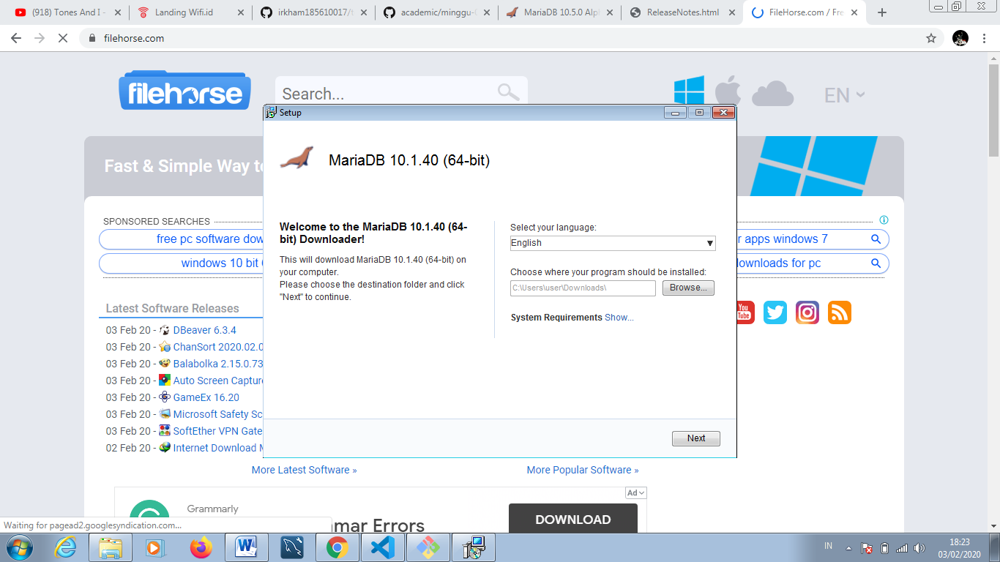
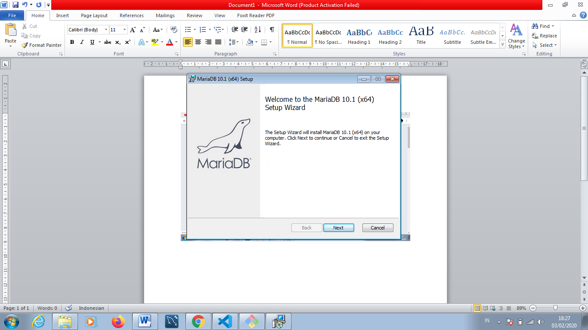
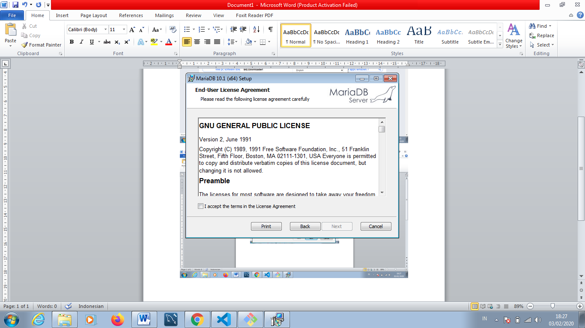
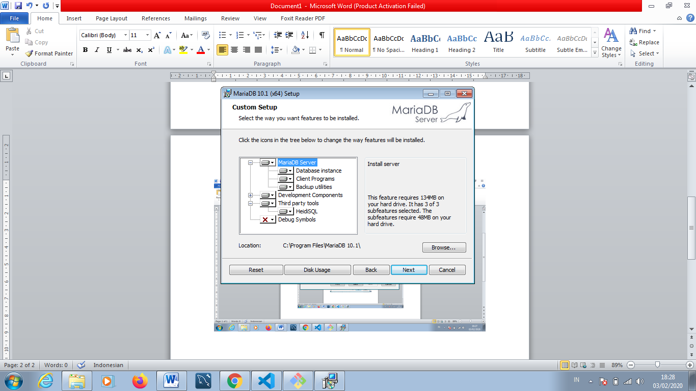
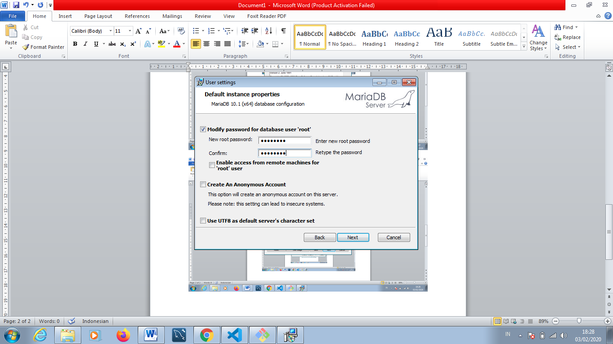
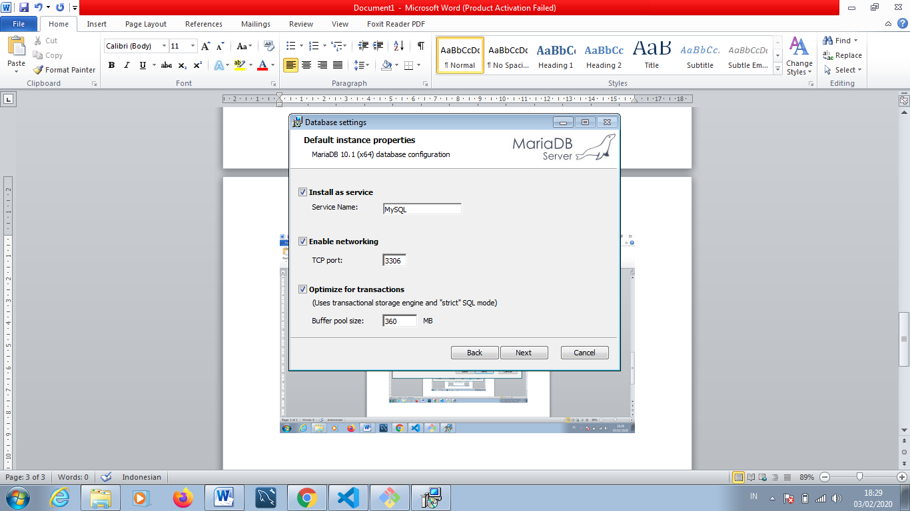
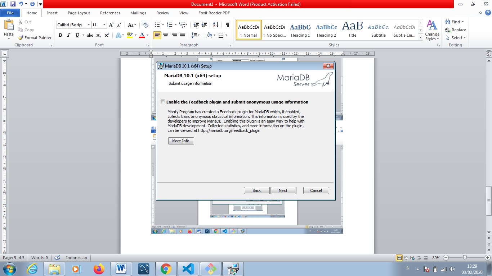
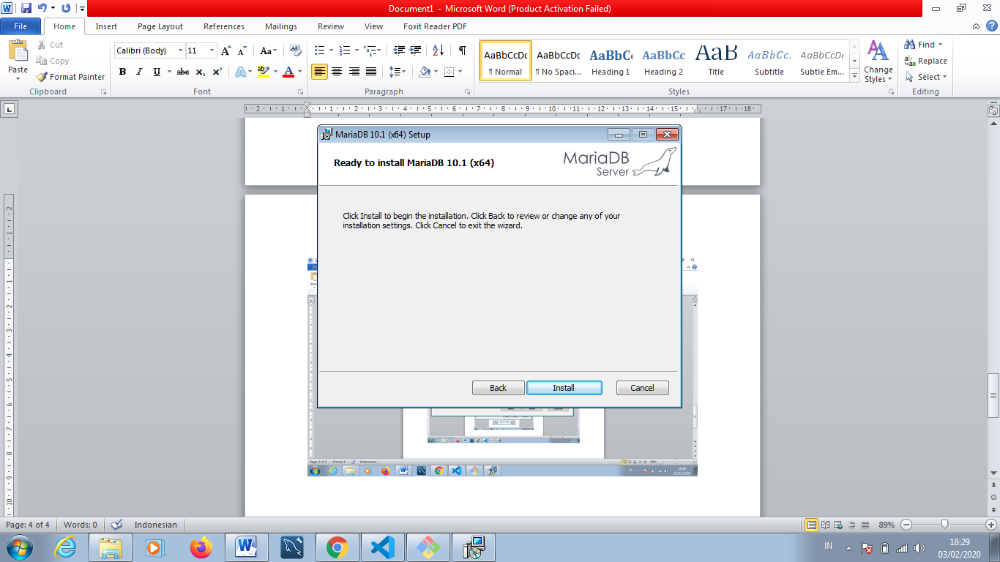
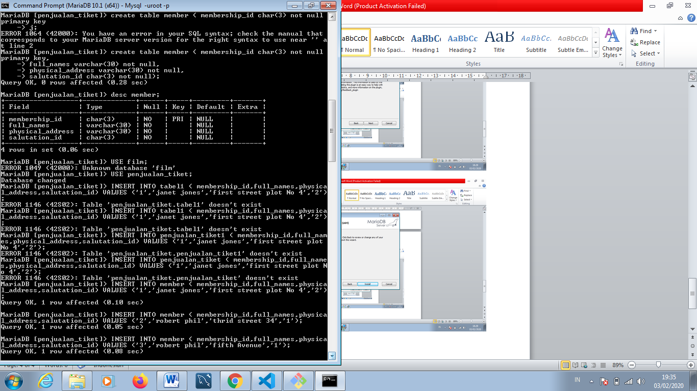
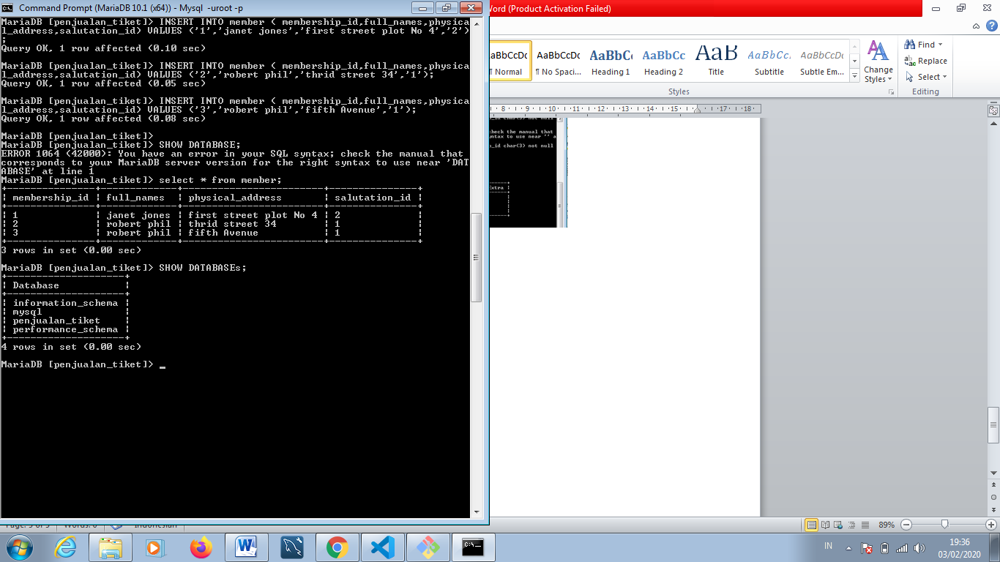

#LAPORAN PRAKTIKUM TEKNOLOGI BASIS DATA PERTEMUAN KE-1
---
#LATIHAN 1

pada latihan 1 ini menginstall mariaDB, terlebih dahulu siapkan software mariaDB untukdiinstall, lalu buka mariaDB, dan 
klik Next terus sampai pada bagian user settings, pada user settings tersebut masukkan password yang dikehendaki oleh pengguna, kemudian
Klik Next dan install, tunggu beberapa menit, kemudian klik finish.
---
LISTING LATIHAN 1
     
   
---