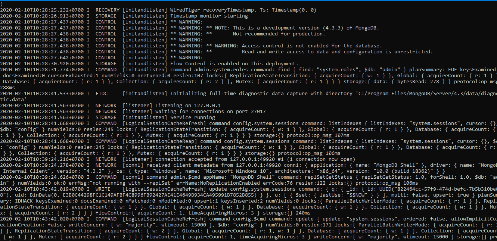
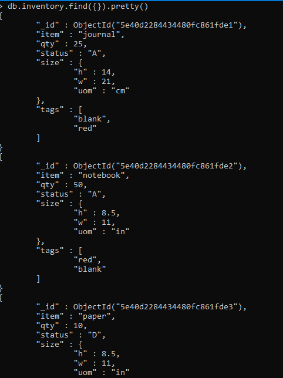
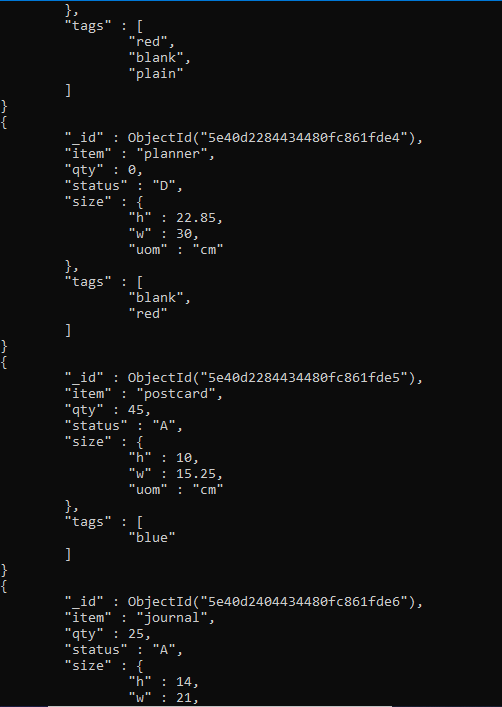
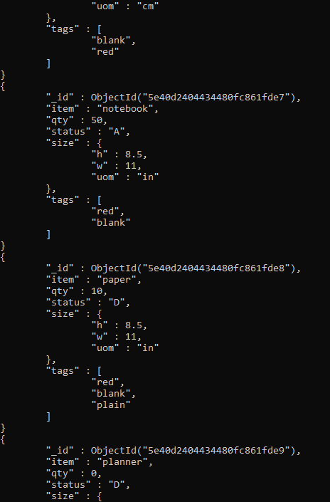
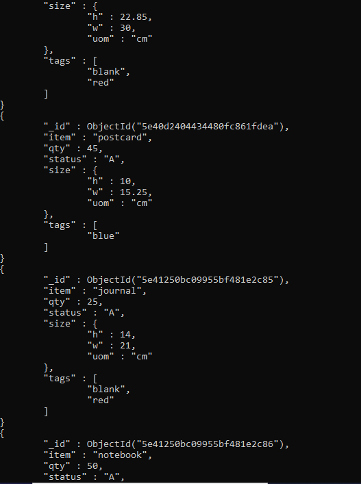
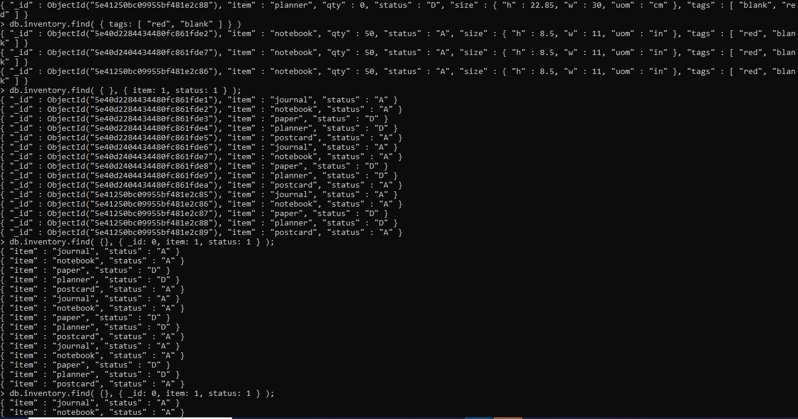
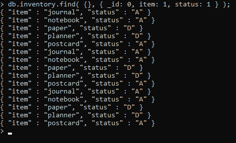
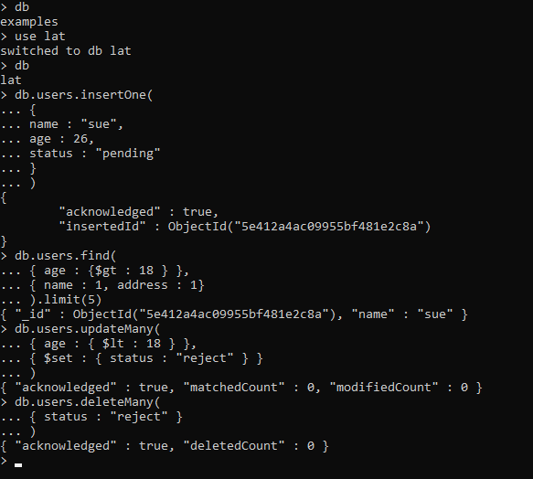

#LAPORAN PRAKTIKUM TEKNOLOGI BASIS DATA PERTEMUAN KE-2
---
#LATIHAN 1

Install MongoDB seperti halnya aplikasi biasa, dan secara default akan tersimpan di C:\Program and Files\mongodb. Kita bisa mengubah lokasi installnya dengan memilih custom pada saat instalasi. Asumsi MongoDB terinstall di C:\mongodb, dan binary nya berada di folder C:\mongodb\bin.

#Setting MongoDB environment
MongoDB membutuhkan folder data untuk menyimpan database, buatlah folder dengan nama dan lokasi c:\data\db

#Start Server MongoDB
Untuk menjalankan daemon/service MongoDB jalankan peritah di bawah ini lewat Command Prompt :

C:\mongodb\bin\mongod.exe
Perintah diatas akan menjalankan server MongoDB silahkan ditunggu, dan biasanya jika muncul pop up Security Alert dialog box nya Windows tinggal di allow saja.

#Connect ke MonggoDB
Untuk menghubungkan MonggoDB, buka Command Prompt baru lalu jalankan mongo.exe

C:\mongodb\bin>mongo.exe
connecting to: test
>
Jika muncul shell mongoDB seperti di atas berarti kita sudah berhasil terhubung ke server MongoDB dan udah siap pakai mengelola database di MongoDB.

 
#Membuat Config File
Untuk menambahkan file konfigurasi MongoDB buat folder baru c:\data\log terlebih dahulu. Buat sebuah file konfigurasi dengan nama file C:\mongodb\mongod.cfg dan buka file tersebut kemudian masukan konfigurasi systemLog.path dan storage.dbPath.

Isi file mongodb.cfg

systemLog:
    destination: file
    path: c:\data\log\mongod.log
storage:
    dbPath: c:\data\db

---
LISTING LATIHAN 1
     
        
---